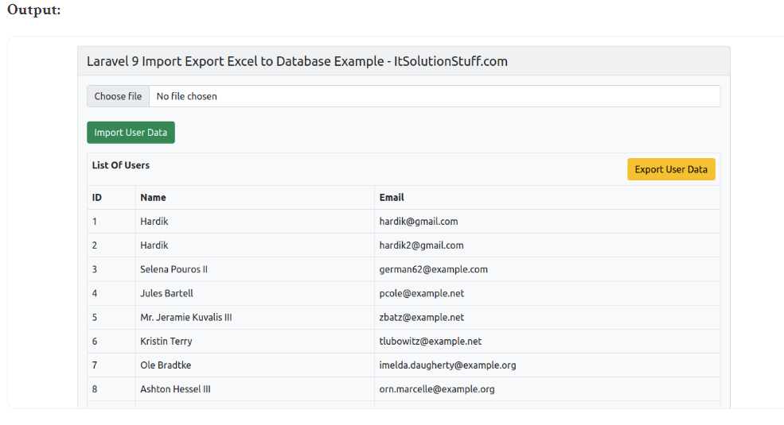

# laravel9_import_export_excel_and_cvs_file
## 1. Install Laravel 9
```Dockerfile
composer create-project laravel/laravel laravel9_import_export_excel_and_cvs_file
```
## 2. Install maatwebsite/excel Package
- chúng ta cần cài đặt gói maatwebsite / excel thông qua trình quản lý gói Composer
```Dockerfile
composer require psr/simple-cache:^1.0 maatwebsite/excel
```
- nếu bạn đang sử dụng phiên bản nhỏ hơn laravel 9 thì chạy lệnh sau 
```Dockerfile
composer require maatwebsite/excel
```
-Nếu lỗi chạy lệnh này :
```Dockerfile
composer require maatwebsite/excel --ignore-platform-reqs
```
## 3. Create Dummy Records
- Trong bước này, chúng tôi sẽ tạo một số bản ghi giả cho bảng người dùng, vì vậy chúng tôi có thể xuất chúng với người dùng đó. vì vậy hãy chạy lệnh tinker dưới đây:
```Dockerfile
php artisan tinker
User::factory()->count(10)->create()
```
## 4. Create Import Class
```Dockerfile
php artisan make:import UsersImport --model=User
```
- Vào app/Imports/UsersImport.php
```Dockerfile
<?php
  
namespace App\Imports;
  
use App\Models\User;
use Maatwebsite\Excel\Concerns\ToModel;
use Maatwebsite\Excel\Concerns\WithHeadingRow;
use Hash;
  
class UsersImport implements ToModel, WithHeadingRow
{
    /**
    * @param array $row
    *
    * @return \Illuminate\Database\Eloquent\Model|null
    */
    public function model(array $row)
    {
        return new User([
            'name'     => $row['name'],
            'email'    => $row['email'], 
            'password' => Hash::make($row['password']),
        ]);
    }
}
```
Bạn có thể tải xuống tệp csv demo trên kho chứa của tôi.
## 5. Create Export Class
```Dockerfile
php artisan make:export UsersExport --model=User
```
- Vào app/Exports/UsersExport.php
```Dockerfile
<?php
  
namespace App\Exports;
  
use App\Models\User;
use Maatwebsite\Excel\Concerns\FromCollection;
use Maatwebsite\Excel\Concerns\WithHeadings;
  
class UsersExport implements FromCollection, WithHeadings
{
    /**
    * @return \Illuminate\Support\Collection
    */
    public function collection()
    {
        return User::select("id", "name", "email")->get();
    }
  
    /**
     * Write code on Method
     *
     * @return response()
     */
    public function headings(): array
    {
        return ["ID", "Name", "Email"];
    }
}
```
## 6. Create Controller
```Dockerfile
php artisan make:controller UserController
```
- Vào app/Http/Controllers/UserController.php
```Dockerfile
<?php
  
namespace App\Http\Controllers;
  
use Illuminate\Http\Request;
use App\Exports\UsersExport;
use App\Imports\UsersImport;
use Maatwebsite\Excel\Facades\Excel;
use App\Models\User;
  
class UserController extends Controller
{
    /**
    * @return \Illuminate\Support\Collection
    */
    public function index()
    {
        $users = User::get();
  
        return view('users', compact('users'));
    }
        
    /**
    * @return \Illuminate\Support\Collection
    */
    public function export() 
    {
        return Excel::download(new UsersExport, 'users.xlsx');
    }
       
    /**
    * @return \Illuminate\Support\Collection
    */
    public function import() 
    {
        Excel::import(new UsersImport,request()->file('file'));
               
        return back();
    }
}
```
## 7. Create Routes
- Vào routes/web.php
```Dockerfile
<?php
  
use Illuminate\Support\Facades\Route;
  
use App\Http\Controllers\UserController;
  
/*
|--------------------------------------------------------------------------
| Web Routes
|--------------------------------------------------------------------------
|
| Here is where you can register web routes for your application. These
| routes are loaded by the RouteServiceProvider within a group which
| contains the "web" middleware group. Now create something great!
|
*/
 
Route::controller(UserController::class)->group(function(){
    Route::get('users', 'index');
    Route::get('users-export', 'export')->name('users.export');
    Route::post('users-import', 'import')->name('users.import');
});
```
## 8.Create Blade File
- Vào resources/views/users.blade.php
```Dockerfile
<!DOCTYPE html>
<html>
<head>
    <title>Laravel 9 Import Export Excel to Database Example - ItSolutionStuff.com</title>
    <link href="https://cdn.jsdelivr.net/npm/bootstrap@5.0.2/dist/css/bootstrap.min.css" rel="stylesheet">
</head>
<body>
     
<div class="container">
    <div class="card bg-light mt-3">
        <div class="card-header">
            Laravel 9 Import Export Excel to Database Example - ItSolutionStuff.com
        </div>
        <div class="card-body">
            <form action="{{ route('users.import') }}" method="POST" enctype="multipart/form-data">
                @csrf
                <input type="file" name="file" class="form-control">
                <br>
                <button class="btn btn-success">Import User Data</button>
            </form>
  
            <table class="table table-bordered mt-3">
                <tr>
                    <th colspan="3">
                        List Of Users
                        <a class="btn btn-warning float-end" href="{{ route('users.export') }}">Export User Data</a>
                    </th>
                </tr>
                <tr>
                    <th>ID</th>
                    <th>Name</th>
                    <th>Email</th>
                </tr>
                @foreach($users as $user)
                <tr>
                    <td>{{ $user->id }}</td>
                    <td>{{ $user->name }}</td>
                    <td>{{ $user->email }}</td>
                </tr>
                @endforeach
            </table>
  
        </div>
    </div>
</div>
     
</body>
</html>
```
## 9.Run Laravel App:
```Dockerfile
php artisan serve
```
- Vào http://localhost:8000/users


